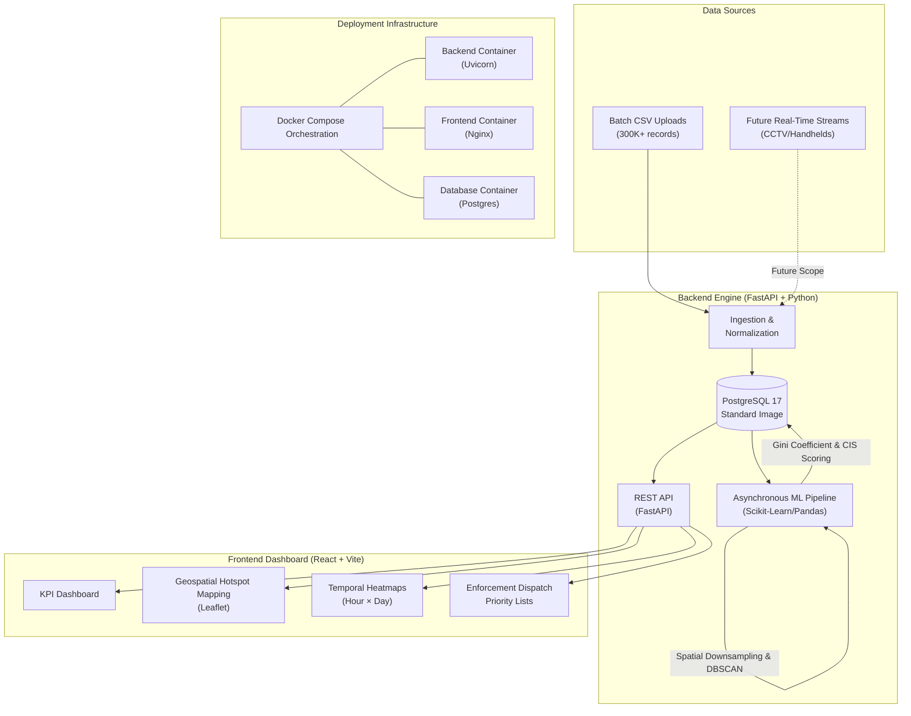

# ParkSense AI — Technical Submission Documentation

## 1. The Problem: Poor Visibility on Parking-Induced Congestion
**Theme 1: Operational Challenge**  
On-street illegal parking and spillover parking near commercial areas, metro stations, and event venues choke carriageways and intersections. Currently, enforcement is patrol-based and highly reactive. Traffic authorities lack visibility into where parking violations cluster and, more importantly, how severely those clusters impact overall traffic flow. 

**Why It's Hard Today**
* Tabular ticket data provides no immediate spatial context.
* There is no mechanism to correlate isolated parking violations with their compounded congestion severity.
* Without impact quantification, it is impossible to efficiently prioritize limited enforcement resources (patrol vehicles and towing trucks).

**Problem Statement:** *How can AI-driven parking intelligence detect illegal parking hotspots and quantify their impact on traffic flow to enable targeted enforcement?*

---

## 2. Solution Architecture & Technical Approach
To solve this, we built **ParkSense**, an intelligence engine that transforms raw, isolated ticketing data into actionable geospatial intelligence. 

### 2.1. The Data Pipeline
Our approach relies on a robust pipeline designed to handle large volumes of asynchronous geospatial data:
1. **Ingestion & Normalization:** Raw CSV data is ingested, cleansed of anomalies, and mapped to a standard relational schema.
2. **Asynchronous Processing Engine:** Built on **FastAPI (Python)**, the system offloads heavy mathematical workloads to background tasks. This ensures the API remains highly responsive, allowing continuous data streams without blocking the event loop.
3. **Data Persistence:** Processed data, clusters, and temporal statistics are stored in **PostgreSQL**. The schema utilizes standard `Float` columns for latitude and longitude, keeping the database extremely lightweight and portable.

### 2.2. Architectural Decision: High-Performance Spatial Math Without PostGIS
In a traditional enterprise geospatial application, a PostgreSQL database would be augmented with the **PostGIS** extension to handle geographic queries (like `ST_Distance` or `ST_DWithin`) directly at the database level. 

However, we made a deliberate architectural choice **not** to use PostGIS for this prototype phase to ensure 100% portability (requiring no specialized spatial binaries for the reviewers). Instead, we architected the system to handle all spatial geometry entirely in-memory using Python, matching PostGIS speeds through clever algorithmic optimizations:

1. **The Fast Bounding Box Pre-filter:** Calculating spherical distance across 300,000 rows would normally crash Python. Instead, we prune the dataset using a vectorized Pandas bounding box (`lat >= min & lat <= max`). CPU processors execute these contiguous memory array operations almost instantly, cutting 300,000 records down to a handful of candidates inside a target grid before any expensive math occurs.
2. **Dynamic Longitude Shrinkage:** 1° of latitude is ~111 km everywhere, but 1° of longitude shrinks significantly as you move away from the equator. Our algorithm dynamically calculates the longitude delta based on the cosine of the local latitude ($\cos(lat)$) to ensure the search radius remains perfectly circular regardless of the city's global position.
3. **Scikit-Learn Ball Trees:** When running the clustering algorithm, we pass `metric="haversine"` and `algorithm="ball_tree"`. This compiles the coordinates (in radians) into a highly specialized spatial tree structure in C++. By grouping nearby points into hierarchical branches, the algorithm evaluates spatial proximity without performing exhaustive $O(n^2)$ point-to-point distance calculations.

---

## 3. Core Intelligence: Machine Learning & Algorithms

Our solution moves away from simple statistical aggregations and employs a sophisticated, multi-stage spatial-temporal engine.

### 3.1. Grid Aggregation & Downsampling
Running spatial clustering directly on 298,445 raw violation coordinates causes severe memory bottlenecks. We engineered a spatial preprocessing step that groups violations into discrete ~55m grid cells. Instead of calculating distances between hundreds of overlapping cars, we compute the "center of mass" for each cell. This reduces the clustering workload from 300K raw points to roughly 10K weighted grid centroids, accelerating the pipeline exponentially while maintaining high geometric fidelity.

### 3.2. Spatial Clustering: DBSCAN vs. K-Means
To group these grid cells into actionable "Hotspots", we implemented **Density-Based Spatial Clustering of Applications with Noise (DBSCAN)**:
* Unlike K-Means, it mathematically adapts to the data to discover clusters of arbitrary shapes (perfect for winding arterial roads).
* It does not require the number of clusters ($k$) to be predefined.
* It identifies and filters out isolated outliers ("noise"), ensuring that random, non-habitual parking tickets don't trigger false hotspot alerts.

### 3.3. Quantifying Impact: The Congestion Impact Score (CIS)
A cluster of 10 cars parked on a narrow arterial road at 9:00 AM causes a massive bottleneck. Conversely, 10 cars parked on a wide residential street at 3:00 AM have zero impact. **Raw violation density does not equal congestion.**

To solve this, we engineered the **Congestion Impact Score (CIS)**—a heuristic mathematical model acting as a highly optimized proxy for traffic degradation.

$$ CIS = \min \left( 100, \sum (W_{volume}\cdot N_{volume} + W_{severity}\cdot N_{severity} + W_{temporal}\cdot N_{temporal} + W_{recurrence}\cdot N_{recurrence}) \times 100 \right) $$

Where each $N$ is a min-max normalized component $[0,1]$ within the temporal cohort, and $W$ is the designated algorithmic weight:
* **Volume ($N_{volume}$):** The raw density of illegal parking incidents.
* **Severity ($N_{severity}$):** The base impact of the violation type itself (e.g., "Double Parking" is algorithmically penalized heavier than "No Parking").
* **Temporal Concentration ($N_{temporal}$):** Using a mathematically corrected **Gini Coefficient** array function. If 50 violations occur in a single 2-hour window, the Gini coefficient spikes toward 1.0, exponentially increasing the CIS to flag a sudden choke-point.
* **Recurrence ($N_{recurrence}$):** Evaluates how many unique days the hotspot persists, penalizing chronic, habitual parking offenses over one-off anomalies.

**Volumetric Priority Boost (Logarithmic Scaling):**
While the CIS dictates the *severity* of the congestion, traffic authorities still need a ranked list to dispatch patrol units. We engineered a **Priority Score** that scales the CIS using a logarithmic volume boost: 
$Priority = CIS \times \left(0.5 + 0.5 \times \frac{\log(1 + V_{hotspot})}{\log(1 + V_{max})}\right)$
By using a base-e logarithmic scale (`np.log1p`), we ensure that extremely massive outliers don't completely crush the priority rankings of moderately sized, yet highly severe, choke-points, providing a perfectly balanced dispatch queue.

---

## 4. Future Scope
* **Live Traffic APIs:** Ping routing APIs (e.g. Google Maps Routes, TomTom) to correlate parking density with real-time speed drops, converting CIS into a proven degradation metric.

* Using cameras that detect the violations, our platform is the Central Command Center that ingests those millions of camera data points to automatically manage city-wide deployment.
