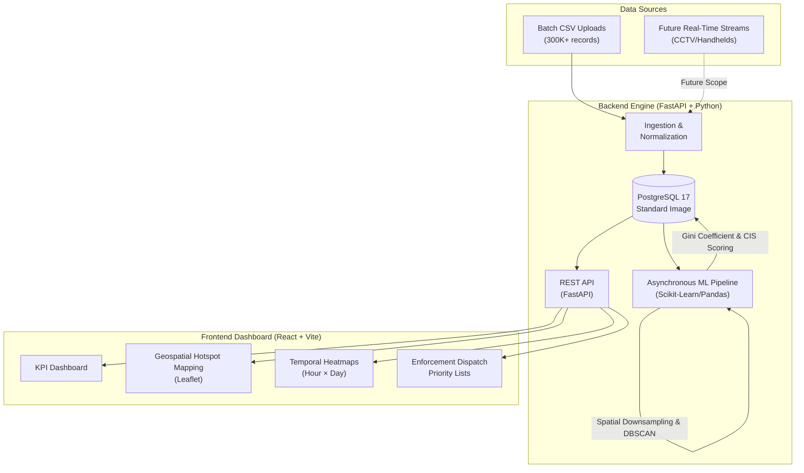

# 🚗 ParkSense AI: Geospatial Parking Intelligence


## 🎯 The Problem
On-street illegal parking chokes city intersections. Current enforcement is entirely reactive because tabular ticketing data provides no spatial context. Authorities cannot see where violations cluster or quantify their compounding impact, making it impossible to efficiently dispatch limited patrol resources or towing trucks.

## 💡Solution Overview

Using the geospatial information from bulk tabular parking tickets, mathematically clusters them into physical hotspots, and scores each cluster's severity based on volume and temporal concentration.

**End-User Deliverables:**

* **Interactive Geospatial Map:** Visualizes physical hotspot boundaries, allowing authorities to instantly see exactly where parking violations cluster.
* **Temporal Heatmaps:** Reveals peak violation times (Hour × Day matrix) to enable predictive, data-driven patrol scheduling rather than random patrols.
* **Ranked Dispatch Priority Lists:** Automatically ranks choke-points by severity, ensuring towing resources are sent to the most critical bottlenecks first.

---

**Impact:** Transforms reactive enforcement into proactive, data-driven dispatching. By scientifically ranking hotspots, authorities can deploy limited towing resources directly to critical choke-points, improving traffic flow.

---

## 🏗️ System Architecture



---

## 🧠 Core Intelligence & ML Algorithms

Our solution moves away from simple statistical aggregations and employs a sophisticated, multi-stage spatial-temporal engine.

### 1. Grid Downsampling & DBSCAN Clustering
* **In-Memory Spatial Math (Zero PostGIS Required):** We bypass heavy PostGIS extensions for maximum portability. By utilizing Vectorized Bounding Boxes, Dynamic Longitude Shrinkage (accounting for Earth's curvature), and C++ Ball Trees (`metric="haversine"`), we achieved identical spatial mapping speeds purely in Python.
* **Algorithmic Downsampling:** 300,000 raw violation coordinates are mathematically compressed into ~10,000 discrete 55m grid centroids to prevent memory exhaustion, accelerating the pipeline exponentially while maintaining geometric fidelity.
* **DBSCAN:** We use Density-Based Spatial Clustering of Applications with Noise (DBSCAN) to discover arbitrary-shaped clusters along winding arterial roads without predefined cluster counts.

### 2. The Congestion Impact Score (CIS)
A cluster of 10 cars parked on a narrow arterial road at 9:00 AM causes a massive bottleneck. Conversely, 10 cars parked on a wide residential street at 3:00 AM have zero impact. **Raw violation density does not equal congestion.**

To solve this, we engineered the **Congestion Impact Score (CIS)**—a mathematical model acting as a highly optimized proxy for traffic degradation:

$$ CIS = \min \left( 100, \sum (W_{volume}\cdot N_{volume} + W_{severity}\cdot N_{severity} + W_{temporal}\cdot N_{temporal} + W_{recurrence}\cdot N_{recurrence}) \times 100 \right) $$

Where each $N$ is a min-max normalized component $[0,1]$ within the temporal cohort, and $W$ is the designated algorithmic weight:
* **Volume ($N_{volume}$):** The raw density of illegal parking incidents.
* **Severity ($N_{severity}$):** The base impact of the violation type itself (e.g., "Double Parking" is penalized heavier than "No Parking").
* **Temporal Concentration ($N_{temporal}$):** Using a mathematically corrected **Gini Coefficient** array. If 50 violations hit in a sudden 2-hour window, the Gini coefficient spikes to 1.0, exponentially raising the CIS to flag a critical, sudden choke-point.
* **Recurrence ($N_{recurrence}$):** Evaluates how many unique days the hotspot persists, penalizing chronic, habitual offenses over one-off anomalies.

### 3. Logarithmic Priority Scaling
While the CIS dictates the *severity* of the congestion, authorities still need a ranked list to dispatch patrol units. We engineered a **Priority Score** that scales the CIS using a base-e logarithmic volume boost:

$$ Priority = CIS \times \left(0.5 + 0.5 \times \frac{\log(1 + V_{hotspot})}{\log(1 + V_{max})}\right) $$

This ensures that while the base CIS prioritizes bottleneck severity, massive volume outliers are still appropriately pushed up the dispatch queue without drowning out smaller, highly-disruptive choke-points.

---

## 🚀 Quick Start (Using Docker)
### Prerequisites
* Docker & Docker Compose installed.

### Run Instructions
1. Clone the repository and open a terminal in the root directory.
2. Spin up the containers:
   ```bash
   docker compose up -d
   ```
3. Docker will automatically pull our custom, pre-seeded PostgreSQL image (`dyuti01/parksense-db:latest`) and build the FastAPI Backend and React Frontend.
4. **View the Application:**
   * **Dashboard:** [http://localhost:3000](http://localhost:3000)
   * **API Docs:** [http://localhost:8000/docs](http://localhost:8000/docs)

*Note: You do not need to upload the dataset CSV. The data is already populated in the database image for demonstration purposes!*

---

## 🔮 Future Scope

* **Live Traffic APIs:** Ping routing APIs (e.g. Google Maps Routes, TomTom) to correlate parking density with real-time speed drops, converting CIS into a proven degradation metric.

* Using cameras that detect the violations, our platform is the Central Command Center that ingests those millions of camera data points to automatically manage city-wide deployment.
