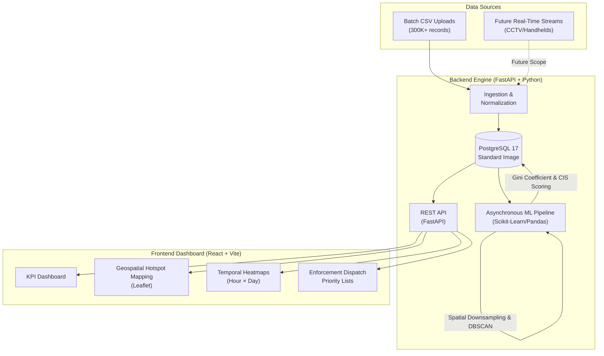

# 🚗 ParkSense AI: Geospatial Parking Intelligence


**ParkSense AI** is a high-performance geospatial intelligence engine designed to transform isolated, tabular parking tickets into actionable insights. By mathematically clustering violations and scoring their true congestion impact, it allows traffic authorities to shift from blind patrolling to data-driven, targeted dispatching.

---

## 🎯 The Problem
On-street illegal parking chokes city intersections. Current enforcement is entirely reactive because tabular ticketing data provides no spatial context. Authorities cannot see where violations cluster or quantify their compounding impact, making it impossible to efficiently dispatch limited patrol resources or towing trucks.

## 💡 The Solution
We built an asynchronous machine learning pipeline that ingests bulk tabular parking data (300K+ records), mathematically groups them into physical hotspots, and scientifically scores each cluster's congestion severity based on volume and temporal concentration.

**End-User Deliverables:**
* **Interactive Geospatial Map:** Visualizes physical hotspot boundaries instantly.
* **Temporal Heatmaps:** Reveals peak violation times (Hour × Day) for predictive patrol scheduling.
* **Ranked Dispatch Lists:** Automatically ranks choke-points by severity, ensuring towing resources hit the most critical bottlenecks first.

---

## 🏗️ System Architecture



---

## 🧠 Core Intelligence & ML Algorithms

* **In-Memory Spatial Math (Zero PostGIS Required):** We bypass heavy PostGIS extensions for maximum portability. By utilizing Vectorized Bounding Boxes, Dynamic Longitude Shrinkage (accounting for Earth's curvature), and C++ Ball Trees (`metric="haversine"`), we achieved identical spatial mapping speeds purely in Python.
* **Grid Downsampling & DBSCAN:** 300K coordinates are compressed into ~10K discrete 55m grid centroids to prevent memory exhaustion. We then use Density-Based Spatial Clustering of Applications with Noise (DBSCAN) to discover arbitrary-shaped clusters along winding arterial roads without predefined cluster counts.
* **Congestion Impact Score (CIS):** Raw violation density does not equal congestion. Our CIS quantifies degradation using 4 normalized metrics: Volume, Severity, Temporal Concentration, and Recurrence.
* **The Gini Coefficient:** If 50 violations hit in a sudden 2-hour window, our corrected Gini Coefficient array spikes to 1.0, exponentially raising the CIS to flag a critical, sudden choke-point.
* **Logarithmic Priority Scaling:** Dispatch priority scales the CIS using a base-e logarithmic volume boost (`np.log1p`), ensuring massive volume outliers don't drown out smaller, severe choke-points.

---

## 🚀 Quick Start (Docker Deployment)

We have fully containerized the application for seamless, one-click evaluation. The database image is pre-seeded with ~298,445 processed violations and pre-calculated ML hotspots for instant demonstration.

### Prerequisites
* Docker & Docker Compose installed.

### Run Instructions
1. Clone the repository and open a terminal in the root directory.
2. Spin up the containers:
   ```bash
   docker compose up -d
   ```
3. Docker will automatically pull our custom, pre-seeded PostgreSQL image (`dyuti01/parksense-db:latest`) and build the FastAPI Backend and React Frontend.
4. **View the Application:**
   * **Dashboard:** [http://localhost:3000](http://localhost:3000)
   * **API Docs:** [http://localhost:8000/docs](http://localhost:8000/docs)

*Note: You do not need to upload the dataset CSV. The data is already populated in the database image for demonstration purposes!*

---

## 🔮 Future Scope

* **Live Traffic APIs:** Ping routing APIs (e.g. Google Maps Routes, TomTom) to correlate parking density with real-time speed drops, converting CIS into a proven degradation metric.

* Using cameras that detect the violations, our platform is the Central Command Center that ingests those millions of camera data points to automatically manage city-wide deployment.
